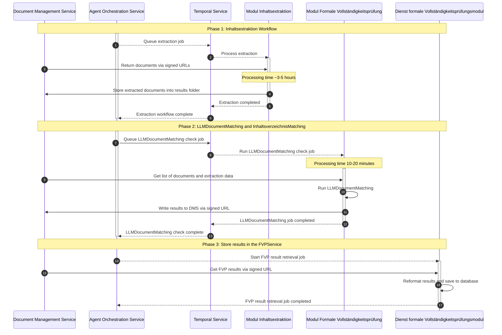

# Modul Formale Vollständigkeitsprüfung (Module Formal Completeness Check)

The *Modul Formale Vollständigkeitsprüfung* automates the Formal Completeness Check to ensure all required documents are present and correctly classified. The check is performed through two complementary tracks:

1. **LLM Document Matching:** Maps uploaded files against a predefined set of required document types to track the existence of documents for each mandatory category.
2. **Inhaltsverzeichnis (TOC) Matching:** Automatically detects, parses, and matches files against the project-specific Table of Contents (TOC) to identify inconsistencies or missing documents.

The goal is to provide users with a clear, automated status of their submission, highlighting exactly where the uploaded files differ from the expected application structure.

## Core Features

### LLM Document Matching

Classifies documents into predefined categories based on semantic content (robust against misleading filenames). Accepts custom document type definitions:

```json
[
   {
      "category": "Category (e.g. Allgemeiner Teil)",
      "document_type_name": "Document Type (e.g. Erläuterungsbericht)",
      "document_type_description": "A very precise description.",
      "expected_count": null
   }
]
```


### Inhaltsverzeichnis (TOC) Finder

Multi-stage pipeline to identify the global Table of Contents (TOC) using textual content, summaries, filenames, and folder structure. Applies hierarchical filtering with strict fail-safes (no TOC match → no document selected). Parses detected TOCs into structured category schemas for downstream matching.

### Inhaltsverzeichnis (TOC) Matching

Combines TOC detection and LLM matching into one workflow: Uses the TOC-derived document descriptions to classify all required documents and validates coverage against the expected submission structure.

## System Architecture

### Overview

The *Modul Formale Vollständigkeitsprüfung* runs as asynchronous Temporal workflows, triggered by the *Agent Orchestration Service*.
It requires prior text extraction via the *Modul Inhaltsextraktion*. Results are stored in the *Dienst formale Vollständigkeitsprüfungsmodul* for frontend display.

### Workflow


### Dependencies

| Service | Link | Purpose |
|---------|------|---------|
| Modul Inhaltsextraktion | [module-inhaltsextraktion](../modul-inhaltsextraktion/README.md) | Preprocessed text extraction data. *Full run on ~200 docs takes several hours.* |
| Document Management Service | [document_management_service](../../02-backend/document_management_service/README.md) | Document and extraction result storage |
| Agent Orchestration Service | [agent_orchestration_service](../../02-backend/agent_orchestration_service/README.md) | Workflow entry point (triggered by frontend) |
| Temporal | [temporal](../../04-shared-services/temporal/README.md) | Asynchronous workflow orchestration |
| Dienst formale Vollständigkeitsprüfungsmodul | [formal_completeness_check](../../02-backend/formal_completeness_check/README.md) | Result persistence and frontend API |
| LiteLLM Proxy | [litellm-proxy](../../04-shared-services/basiskomponenten/litellm-proxy/README.md) | Unified OpenAI-compatible LLM gateway |

## Getting Started

### Prerequisites

- [uv](https://docs.astral.sh/uv/)
- Shared platform services from the [root README](../../README.md#dependencies) when running locally

### Configuration

1. **Environment Variables**: Create `.env` based on `.env.local`. Configure API keys, LLM settings, and service endpoints.
2. **Windows (Critical)**: Set `PYTHONUTF8=1` before running workflows, otherwise Umlaute / UTF-8 handling degrades classification performance.

### Running the Application

#### In Development

1. **Setup Python Environment**:
   ```bash
   uv venv --python 3.13
   uv sync --all-extras --inexact --package formale-pruefung
   ```
2. **Start Temporal**:
   ```bash
   # From repo root
   cd ../.. && docker compose up -d
   ```
   Alternatively, install [Temporal CLI](https://docs.temporal.io/cli) and use `temporal server start-dev`.
   
3. **Register the Temporal workers**:
   ```bash
   PYTHONPATH=. python main.py
   ```
   Restart after code changes.

4. **Trigger Workflows**:
   Workflows can be triggered programmatically via the backend orchestration service or manually via the Temporal Web UI.

   **Manual via Temporal UI:**

   Task Queue: `formale-pruefung`

   **LLMMatchingWorkflow** — `project_id` must reference a DMS project with the completed process of *Modul Inhaltsextraktion*. `document_ids` is optional (subset classification).  
   `data/document_types_sample.json` contains sample document types you can use to call the workflow. Adjust these to your use case.

   ```json
   {
      "project_id": "00000000-0000-0000-0000-000000000000",
      "document_types": [
         {
            "category": "Category (e.g. Allgemeiner Teil)",
            "document_type_name": "Document Type (e.g. Erläuterungsbericht)",
            "document_type_description": "A very precise description.",
            "expected_count": null
         }
      ],
      "document_ids": null,
      "external_preprocessing": false
   }
   ```

   **InhaltsverzeichnisMatchingWorkflow:**
   ```json
   {
      "project_id": "00000000-0000-0000-0000-000000000000",
      "document_types": [...]
   }
   ```

#### In Production

Start Temporal workers and platform services from the repo root:

```bash
cd ../.. && docker compose up -d
```

Trigger workflows programmatically via backend orchestration or via the Temporal Web UI.

## Project Structure

```
├── main.py                 # Temporal worker entry point
├── data/                   # Sample document type definitions
├── src/
│   ├── activities/         # Temporal activities (I/O operations)
│   ├── config/             # Configuration and environment variables
│   ├── models/             # LLM client factories
│   ├── prompts/            # LLM prompt templates
│   ├── schemas/            # Pydantic data models
│   ├── services/           # External service clients (DMS)
│   ├── utils/              # Shared utilities
│   └── workflows/          # Temporal workflows (orchestration logic)
```

## Monitoring

- **Temporal UI:** Monitor workflow executions, activity retries, and execution history at [http://localhost:8080](http://localhost:8080).
- Monitor the upstream workflows of *Modul Inhaltsextraktion* and the DMS data, as their failure can cause FVP workflows to fail.

## Troubleshooting

<details>
<summary>Low Classification Accuracy</summary>

Verify that `document_type_description` fields are precise and non-overlapping. Vague or generic descriptions significantly degrade matching quality.

</details>

<details>
<summary>UTF-8 Issues on Windows</summary>

Set `PYTHONUTF8=1` before running any workflows. Without this, Umlaute in prompts and documents may be corrupted, reducing classification performance by more than 50%.

</details>

<details>
<summary>Temporal Worker Not Picking Up Jobs</summary>

Ensure the worker is registered on the correct task queue (`formale-pruefung`) and that Temporal Server is reachable at the configured URL. Restart the worker after code changes.

</details>

<details>
<summary>Workflows Failing Immediately</summary>

Verify that the required extraction data exists in the DMS. The *Modul Formale Vollständigkeitsprüfung* requires the process of *Modul Inhaltsextraktion* to complete successfully first, which can take multiple hours for a full application.

</details>

<details>
<summary>LLM API Rate Limits (429 Errors)</summary>

Check your LLM provider quotas and deployment configuration. Consider adjusting rate limits in the LiteLLM proxy.

</details>

> **Note:** LLM outputs are inherently non-deterministic. Results may vary slightly between runs on identical inputs.
