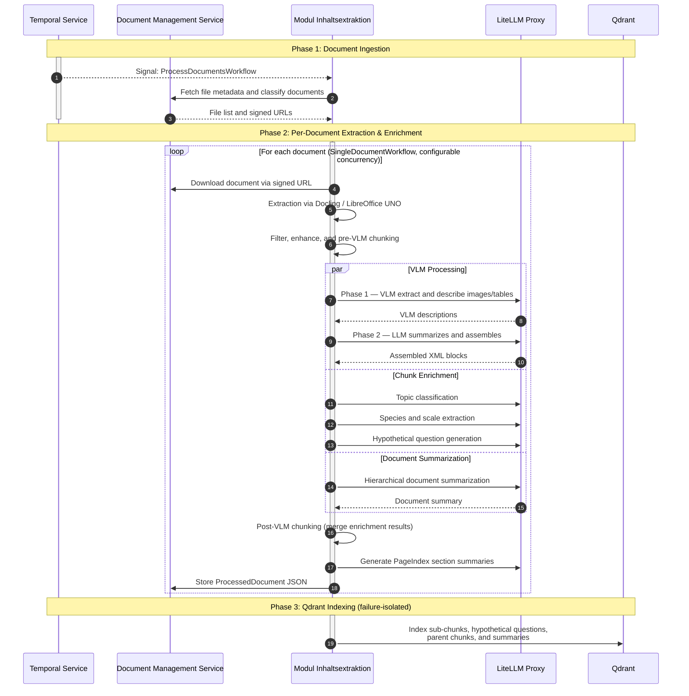
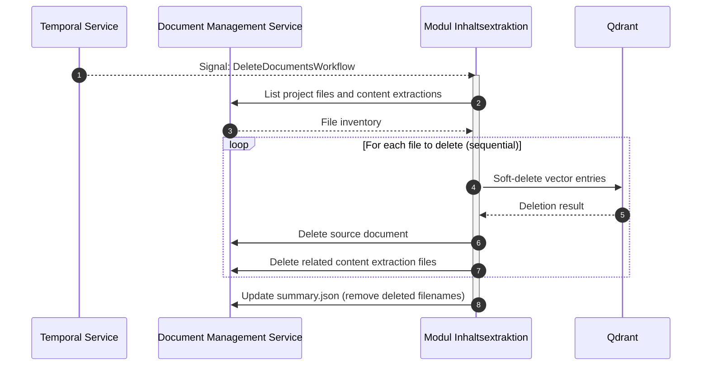

# Modul Inhaltsextraktion (Module Content Extraction)

A Temporal-orchestrated pipeline for extracting content and metadata from documents (PDF, DOCX, PPTX). Converts documents to structured Markdown, enriches them with AI-generated metadata and summaries, indexes into Qdrant for vector search, and extracts hierarchical document structures.

> **Domain Context:** This module was developed for processing large-scale German planning and approval applications (*Planfeststellungsverfahren*). These applications can contain hundreds of heterogeneous documents — technical reports, environmental impact assessments, maps, and legal texts. While the extraction pipeline is domain-agnostic, some configuration defaults and examples reflect this origin.

## Core Features

- **Multi-Format Document Conversion:** Converts PDF, DOCX, and PPTX into clean, structured Markdown
- **AI-Powered Metadata Extraction:** Automatically extracts titles, document types, and page counts
- **Advanced Image and Table Analysis:** Uses a Visual Language Model (VLM) to extract content from images and tables with human-readable descriptions
- **Temporal Workflow Orchestration:** Built on Temporal for reliable, durable, and observable workflow execution with automatic retries
- **Asynchronous and Scalable:** Parallel processing with configurable concurrency limits and per-model rate limiting
- **Qdrant Vector Indexing:** Indexes processed document chunks into Qdrant for semantic search
- **PageIndex Structure Extraction:** Extracts hierarchical document structure with LLM-generated summaries per section
- **Document Deletion:** Soft-deletes selected documents and their derived data (Qdrant entries, DMS files, summary references) with per-file failure tracking
- **Integrated Monitoring:** Pre-configured Grafana dashboards and Prometheus metrics

## System Architecture

### Overview

Built on **Temporal** with clear separation between workflows (orchestration) and activities (I/O). All LLM / embedding calls are routed through a **LiteLLM proxy**. Large data uses a pass-by-reference pattern (DMS file IDs) to avoid Temporal payload limits.

### Workflow






### Workflows

| Workflow | Description |
|----------|-------------|
| `ProcessDocumentsWorkflow` | Main orchestrator. Fetches file metadata from DMS, resolves priority documents, and dispatches `SingleDocumentWorkflow` child workflows with configurable concurrency. |
| `SingleDocumentWorkflow` | Per-document pipeline: extraction → filtering → VLM enhancement → chunk enrichment → summarization → assembly of the final `ProcessedDocument` JSON. |
| `DoclingExtractionWorkflow` | PDF extraction via docling-serve. Splits large PDFs into page chunks, converts office formats to PDF first if needed, and uploads debug artifacts. |
| `VLMProcessingWorkflow` | Two-phase visual element processing. Phase 1: VLM extracts and describes images / tables (semaphore-gated). Phase 2: LLM summarizes results and assembles final XML blocks. |
| `ChunkEnrichmentWorkflow` | Parallel enrichment orchestrator. Runs topic classification (`SchwerpunktWorkflow`), species/scale extraction (`SpeciesScaleWorkflow`), and hypothetical question generation (`HypotheticalQuestionsWorkflow`) as independent child workflows. |
| `DocumentSummarizationWorkflow` | Hierarchical document summarization. Summarizes chunks in batches via `SummarizationWorkflow` children, then iteratively reduces to a single document-level summary. |
| `PageindexStructureWorkflow` | Per-document step within `SingleDocumentWorkflow`. Extracts a hierarchical document structure from markdown headers and generates LLM summaries for each section node. |
| `QdrantBuilderWorkflow` | Post-extraction step (failure-isolated). Indexes processed sub-chunks, hypothetical questions, parent chunks, and summaries into Qdrant for semantic search. |
| `DeleteDocumentsWorkflow` | Soft-deletes specified documents and all derived data — Qdrant entries, DMS content-extraction files, and summary references — with per-file failure tracking. |

### Dependencies

| Service | Purpose | Required |
|---------|---------|----------|
| Temporal Server | Workflow orchestration and scheduling | Yes |
| LiteLLM Proxy | Unified LLM / embedding API gateway | Yes |
| Document Management Service | Document storage (upload / download via signed URLs) | Yes |
| Docling-serve | PDF-to-Markdown conversion | Yes |
| LibreOffice UNO | Office format (DOCX / PPTX) to PDF conversion | Yes |
| S3 / MinIO | Large payload storage for Temporal (>2MB payloads) | Yes |
| Qdrant | Vector database for semantic search indexing | Yes |
| Prometheus + Grafana | Monitoring and dashboards | Optional |

## Project Structure

```
├── main.py                 # Temporal worker entry point
├── run_workflow.py          # CLI to trigger workflows
├── scripts/                 # Utility scripts (DMS upload, smoke tests)
├── docker/                  # Docker and compose configuration
├── k8s/                     # Kubernetes manifests (Kustomize overlays)
└── src/
    ├── workflows/           # Temporal workflows (orchestration logic)
    ├── activities/          # Temporal activities (atomic I/O operations)
    ├── processors/          # Content processing (chunking, filtering)
    ├── providers/           # PDF extraction providers (Docling)
    ├── models/              # LLM/embedding client factories
    ├── services/            # External service clients
    └── utils/               # Shared utilities (DMS client, auth, rate limiting)
```

## Getting Started

### Prerequisites

- [uv](https://docs.astral.sh/uv/)
- Shared platform services from the [root README](../../README.md#dependencies) when running locally

### Configuration

1. **Create an environment file:**

    ```bash
    cp .env.local .env
    ```

2. **Edit `.env`** with your environment-specific values. Key variable groups:

    <details>
    <summary><b>Core Services</b></summary>

    | Variable | Description |
    |----------|-------------|
    | `DMS_BASE_URL` | DMS service URL |
    | `TEMPORAL_SERVER_URL` | Temporal server address |
    | `TEMPORAL_TASK_QUEUE` | Temporal task queue name |
    | `TEMPORAL_S3_BUCKET_NAME` | S3 bucket for large payload storage |
    | `TEMPORAL_S3_REGION` | S3 region |
    | `TEMPORAL_S3_ENDPOINT_URL` | S3 endpoint URL |
    | `TEMPORAL_S3_ACCESS_KEY_ID` | S3 access key |
    | `TEMPORAL_S3_SECRET_ACCESS_KEY` | S3 secret key |
    | `EXTRACTION_PROVIDER` | Extraction provider (default: `docling`) |
    | `SINGLE_DOCUMENT_WORKFLOW_CONCURRENCY` | Concurrent document workflows |

    </details>

    <details>
    <summary><b>LLM & Embedding Models</b></summary>

    All LLM and embedding calls are routed through a LiteLLM proxy.

    | Variable | Description |
    |----------|-------------|
    | `LITELLM_BASE_URL` | LiteLLM proxy URL |
    | `LITELLM_MASTER_KEY` | LiteLLM proxy API key |
    | `VLLM_MODEL` | VLM model identifier |
    | `METADATA_MODEL_NAME` | Model for metadata extraction |
    | `SCHWERPUNKTTHEMA_MODEL_NAME` | Model for topic classification |
    | `SUMMARIZATION_MODEL_NAME` | Model for summarization |
    | `VLM_SUMMARY_MODEL_NAME` | Model for VLM summaries |
    | `STRUCTURE_MODEL_NAME` | Model for PageIndex structure extraction |
    | `IONOS_EMBEDDING_MODEL` | Embedding model name |

    </details>

    <details>
    <summary><b>External Services</b></summary>

    | Variable | Description |
    |----------|-------------|
    | `DOCLING_HOST` / `DOCLING_PORT` | Docling-serve address |
    | `DOCLING_OCR_ENGINE` | OCR engine for Docling (default: `easyocr`) |
    | `UNO_HOST` / `UNO_PORT` / `UNO_PROTOCOL` | LibreOffice UNO server |
    | `QDRANT_BASE_URL` | Qdrant vector DB URL |
    | `QDRANT_DENSE_VECTOR_SIZE` | Qdrant dense vector dimensions |

    </details>

    <details>
    <summary><b>Per-Model Throttles</b></summary>

    Process-local concurrency limits (per worker instance). Each throttle combines `MAX_CONCURRENT` (semaphore) and `RATE_PER_MINUTE` (token bucket, 0 = disabled).

    | Throttle Prefix | Controls |
    |-----------------|----------|
    | `THROTTLE_GLOBAL` | Global fallback |
    | `THROTTLE_VLM` | VLM extraction calls |
    | `THROTTLE_VLM_SUMMARY` | VLM summary generation |
    | `THROTTLE_SUMMARIZATION` | Document summarization |
    | `THROTTLE_SCHWERPUNKTTHEMA` | Topic classification |
    | `THROTTLE_METADATA` | Metadata extraction |
    | `THROTTLE_HYPOTHETICAL_QUESTIONS` | Question generation |
    | `THROTTLE_SPECIES_SCALE` | Species/scale extraction |
    | `THROTTLE_STRUCTURE` | PageIndex structure summaries |
    | `THROTTLE_EMBEDDING` | Embedding requests |

    </details>

    <details>
    <summary><b>Authentication (Optional)</b></summary>

    If your DMS instance requires OAuth2 authentication, configure the following variables. If no authentication is needed, leave these unset — the client will skip token acquisition.

    | Variable | Description |
    |----------|-------------|
    | `KEYCLOAK_CLIENT_ID` | OAuth2 client ID |
    | `KEYCLOAK_CLIENT_SECRET` | OAuth2 client secret |
    | `KEYCLOAK_TOKEN_URL` | OAuth2 token endpoint URL |

    </details>

### Running the Application

#### Full Stack (Recommended)

```bash
# From the repository root:
sh scripts/create_secrets.sh
docker compose up -d
docker compose -f docker-compose.services.yaml up -d
```

#### This Service Only

With platform services already running:

1. **Install dependencies and start the worker:**

    ```bash
    uv sync --all-packages
    uv run main.py
    ```

2. **Upload test files and run a workflow:**

    ```bash
    # Upload files to DMS and get the project JSON
    uv run scripts/create_dms_project.py ./scripts/docx

    # Run the workflow (paste the JSON from above)
    uv run run_workflow.py PROJECTID
    ```

3. **Monitor** via Temporal UI at [http://localhost:8080](http://localhost:8080)

The `run_workflow.py` script orchestrates three stages:

```bash
uv run run_workflow.py                              # all steps (default)
uv run run_workflow.py --steps extraction            # extraction only
uv run run_workflow.py --steps qdrant pageindex      # post-processing only
```

To **delete documents** from an existing project:

```bash
uv run scripts/delete_workflow.py --project-id <UUID> --file-ids <UUID1> <UUID2>
```

#### In Production

Configure via environment variables in your deployment. The worker connects to Temporal and polls the configured task queue automatically.

## Monitoring

- **Temporal UI:** [http://localhost:8080](http://localhost:8080) — Workflow executions, activity retries, child workflows, and execution history
- **Prometheus:** [http://localhost:9095](http://localhost:9095) — Metrics collection
- **Grafana:** [http://localhost:3007](http://localhost:3007) — Pre-built dashboards in `grafana/dashboards/`

## Troubleshooting

<details>
<summary>Docker Layer Corruption After VM Restart</summary>

If you encounter errors like "layer does not exist" or "blob not found" after a VM crash or improper shutdown:

```bash
docker system prune -a --volumes
```

</details>

<details>
<summary>Temporal "Complete result exceeds size limit" Error</summary>

This means an activity is returning data larger than 2MB through Temporal.

**Solution:** Use the pass-by-reference pattern — upload large data to DMS within the activity and return only the file ID (UUID).

```python
# Bad — Returns large data
async def process_document(...) -> str:
    large_data = ...  # 5MB of data
    return large_data  # Exceeds 2MB limit!

# Good — Returns file ID
async def process_document(...) -> str:
    large_data = ...
    file_id = await upload_to_dms(large_data)
    return file_id  # Only 36 bytes (UUID)
```

</details>

<details>
<summary>Connection Errors During LLM Calls</summary>

Too many parallel LLM requests overwhelming the service.

**Solution:** Lower the per-model throttle in `.env`:

```bash
THROTTLE_SCHWERPUNKTTHEMA_MAX_CONCURRENT=5
THROTTLE_SCHWERPUNKTTHEMA_RATE_PER_MINUTE=60
```

For global rate limiting across workers, configure limits in the LiteLLM proxy.

</details>

<details>
<summary>VLM Child Workflow Explosion</summary>

Documents with 100+ images create many child workflows. Batching is controlled by `TEMPORAL_VLM_CHILD_WORKFLOW_BATCH_SIZE` (default: 20).

</details>
