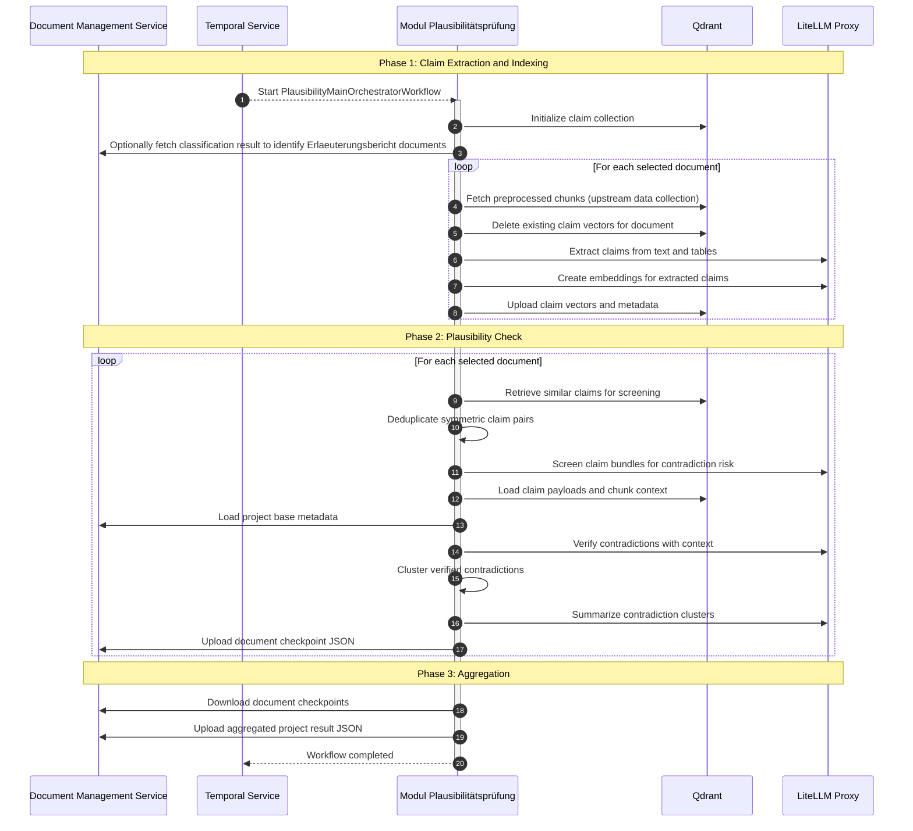

# Modul Plausibilitätsprüfung (Module Plausibility Check)

This module performs the **plausibility check** ("Plausibilitätsprüfung") of large legal planning applications.
It extracts structured factual claims from preprocessed document chunks, compares semantically related
statements and identifies likely contradictions across a project.


## Core Features

- **Three-Phase Pipeline**: Claim extraction → plausibility check → result aggregation
- **Claim Extraction**: Extracts structured claims from text and table chunks (with table batching for large tables). Filters unsupported / short chunks automatically
- **Semantic Candidate Retrieval**: Embeds claims in Qdrant and retrieves similar claims via vector search across three pools (cross-document, local neighbors, broader same-document). Supports incremental reprocessing per document
- **Multi-Stage Contradiction Detection**: Risk screening (0–100 score, configurable threshold) → context-aware verification → clustering and summarization. Symmetric pairs are deduplicated before screening
- **DMS Checkpoint Outputs**: Uploads per-document and aggregated project-level result JSON files to the DMS


## System Architecture

### Overview

Executed asynchronously in Temporal. Depends on preprocessed data from *Modul Inhaltsextraktion* (chunked documents and summaries in Qdrant / DMS). Builds a claim index, runs plausibility checks and uploads contradiction results back to the DMS.

### Workflow


### Dependencies

| Service | Link | Purpose |
|---------|------|---------|
| Modul Inhaltsextraktion | [module-inhaltsextraktion](../modul-inhaltsextraktion/README.md) | Chunked document content, summaries, and Qdrant data collections |
| Modul Formale Vollständigkeitsprüfung | [module-formale-pruefung](../modul-formale-pruefung/README.md) | Optional classification output to identify Erläuterungsbericht documents |
| Document Management Service | [document_management_service](../../02-backend/document_management_service/README.md) | Source documents, extraction outputs, and checkpoint storage |
| Temporal | [temporal](../../04-shared-services/temporal/README.md) | Asynchronous workflow orchestration |
| LiteLLM Proxy | [litellm-proxy](../../04-shared-services/basiskomponenten/litellm-proxy/README.md) | OpenAI-compatible gateway for all LLM/embedding calls |


## Output Schema

Writes one JSON file per document and one aggregated file. Both share the same structure: A `contradictions` array.

> Output keys use camelCase (Pydantic alias serialization).

### Contradiction Object

| Field | Type | Description |
| --- | --- | --- |
| `id` | string (UUID) | Unique identifier |
| `title` | string | Short summary |
| `description` | string | Detailed explanation from cluster summarizer |
| `status` | `"OPEN"` \| `"CLOSED"` | Always `"OPEN"` when produced; `"CLOSED"` reserved for downstream |
| `occurrences` | array of Occurrence | Document locations evidencing the contradiction |

### Occurrence Object

| Field | Type | Description |
| --- | --- | --- |
| `documentId` | string (UUID) | Source document ID in the DMS |
| `documentName` | string \| null | Human-readable document title |
| `contentExcerpt` | string | Text excerpt illustrating the contradiction |
| `contradiction` | string | Description of the contradiction at this location |
| `pageNumber` | integer \| null | Page number, if available |

<details>
<summary> Domain-specific example (based on German planning applications (Planfeststellungsverfahren))</summary>

```json
{
  "contradictions": [
    {
      "id": "3fa85f64-5717-4562-b3fc-2c963f66afa6",
      "title": "Widersprüchliche Flächenangaben zwischen Erläuterungsbericht und Bebauungsplan",
      "description": "Der Erläuterungsbericht gibt die Gesamtfläche des Plangebiets durchgehend mit 4,5 ha an, während der Bebauungsplan sowohl im Fließtext als auch in der Flächenbilanz 3,8 ha für dasselbe Plangebiet ausweist. Die Abweichung tritt in zwei unabhängigen Plandokumenten auf und lässt sich nicht durch unterschiedliche Abgrenzungen oder Planungsphasen erklären.",
      "status": "OPEN",
      "occurrences": [
        {
          "documentId": "00000000-0000-0000-0000-000000000001",
          "documentName": "Erläuterungsbericht 2024",
          "contentExcerpt": "Die Gesamtfläche des Plangebiets beträgt 4,5 ha und umfasst die Flurstücke 112 und 113.",
          "contradiction": "Gibt 4,5 ha als Gesamtfläche an, was dem im Bebauungsplan genannten Wert von 3,8 ha widerspricht.",
          "pageNumber": 12
        },
        {
          "documentId": "00000000-0000-0000-0000-000000000002",
          "documentName": "Bebauungsplan Nr. 47 — Textliche Festsetzungen",
          "contentExcerpt": "Das Plangebiet umfasst eine Fläche von 3,8 ha (Flurstücke 112 und 113 der Gemarkung Musterstadt).",
          "contradiction": "Gibt 3,8 ha als Gesamtfläche an, was dem im Erläuterungsbericht genannten Wert von 4,5 ha widerspricht.",
          "pageNumber": 3
        },
        {
          "documentId": "00000000-0000-0000-0000-000000000002",
          "documentName": "Bebauungsplan Nr. 47 — Textliche Festsetzungen",
          "contentExcerpt": "Flächenbilanz: Gesamtplangebiet 3,80 ha, davon Wohnbaufläche 2,10 ha, Verkehrsfläche 0,45 ha, Grünfläche 1,25 ha.",
          "contradiction": "Die Flächenbilanz weist ebenfalls 3,8 ha aus, was mit dem Plantext übereinstimmt, aber dem Erläuterungsbericht widerspricht.",
          "pageNumber": 8
        }
      ]
    }
  ]
}
```

</details>

## Project Structure

```
├── main.py                     # Temporal worker entry point
├── run_workflow.py              # CLI to trigger workflows locally
├── run_workflow_config.yaml.example  # Example workflow trigger config
├── scripts/                    # Utility scripts (e.g. port forwarding)
└── src/
    ├── activities/             # Temporal activities (I/O and LLM operations)
    ├── config/                 # Configuration and environment variables
    ├── dms/                    # DMS client and schemas
    ├── models/                 # LLM and embedding client factories
    ├── qdrant/                 # Qdrant client and schemas
    └── workflows/              # Temporal workflows (orchestration logic)
```

## Getting Started

### Prerequisites

- [uv](https://docs.astral.sh/uv/)
- Shared platform services from the [root README](../../README.md#dependencies) when running locally

### Configuration

1. **Environment Variables**: Create `.env` based on `.env.local`. Configure LiteLLM, Qdrant, DMS, Temporal, S3 payload storage (`TEMPORAL_S3_*`), and OpenTelemetry settings. `TEMPORAL_LLM_MAX_PER_SECOND` controls LLM dispatch rate. `QDRANT_VECTOR_SIZE` must match the output dimensions of the configured embedding model (e.g. `BAAI/bge-m3` produces 1024-dimensional vectors).

2. **Workflow Trigger Config** (for local test runs):
   ```bash
   cp run_workflow_config.yaml.example run_workflow_config.yaml
   ```
   Then edit `run_workflow_config.yaml` with your `project_id`, `document_ids`, and optional `classification_file_id`.

### Running the Application

#### In Development

1. **Setup Python Environment** (run from the repository root):
   ```bash
   uv venv --python 3.13
   uv sync --package plausibilitaets-pruefung
   ```

2. **Start Platform Services** (from repo root):

   ```bash
   docker compose up -d
   # Optionally also DMS and LiteLLM:
   docker compose -f docker-compose.services.yaml up -d
   ```

   Alternatively, point environment variables to an existing deployment.

3. **Start the Temporal Workers**:
   ```bash
   uv run main.py
   ```
   This starts two workers:
   - the main worker on `plausibilitaets-pruefung`
   - the LLM worker on `plausibilitaets-pruefung-llm`

4. **Trigger a Local Test Workflow**:
   ```bash
   uv run run_workflow.py
   ```

#### Manual Workflow Trigger via Temporal UI

Task Queue: `plausibilitaet-pruefung`  
Workflow Type: `PlausibilityMainOrchestratorWorkflow`
```json
{
  "project_id": "00000000-0000-0000-0000-000000000000",
  "document_ids": [
    "00000000-0000-0000-0000-000000000001"
  ],
  "classification_file_id": "00000000-0000-0000-0000-000000000002"
}
```

`classification_file_id` is optional. If `document_ids` is empty, the result contains an empty contradictions list.

#### In Production

Start Temporal workers and ensure DMS, Qdrant, LiteLLM, and the upstream extraction pipeline are available. Trigger workflows via backend orchestration or Temporal UI.


## Monitoring

- **Temporal Web UI**: Workflow execution, activity retries, child workflow progress
- **DMS Outputs**: Per-document files (`plausibility_{document_id}_{run_id}.json`) and aggregated file (`aggregated_plausibility_results_{run_id}.json`)
- **Qdrant**: Verify `plausibility` collection is populated and upstream `data` collection has chunk payloads
- **OpenTelemetry / Logs**: LLM failures, upload errors, missing upstream metadata


## Troubleshooting

<details>
<summary>Claim Extraction Yields No Claims</summary>

Verify that the upstream Qdrant `data` collection contains extracted chunks for the target project. This module does not perform OCR or content extraction itself.

</details>

<details>
<summary>No Erläuterungsbericht Documents Detected</summary>

Check whether `classification_file_id` points to a valid classification JSON in the DMS. The workflow still runs without it, but retrieval is less specialized.

</details>

<details>
<summary>Qdrant Errors or Empty Retrieval Results</summary>

Confirm that `QDRANT_CLUSTER_ENDPOINT` is correct and that the upstream extraction pipeline populated the expected data collections.

</details>

<details>
<summary>LLM Rate Limits or Slow Runs</summary>

Review model quotas, LiteLLM routing, and `TEMPORAL_LLM_MAX_PER_SECOND`.

</details>

<details>
<summary>Missing Final Results in DMS</summary>

Inspect failed upload or aggregation activities in Temporal. Document checkpoints are uploaded first, followed by the aggregated JSON.

</details>

<details>
<summary>Inconsistent Results Between Runs</summary>

LLM outputs are non-deterministic — results may vary between runs. Output quality is significantly affected by model choice.

</details>
