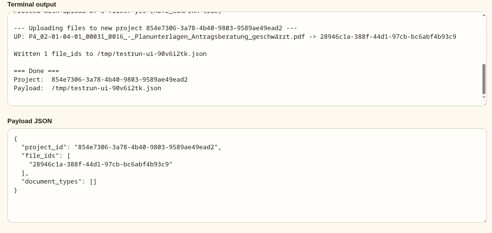
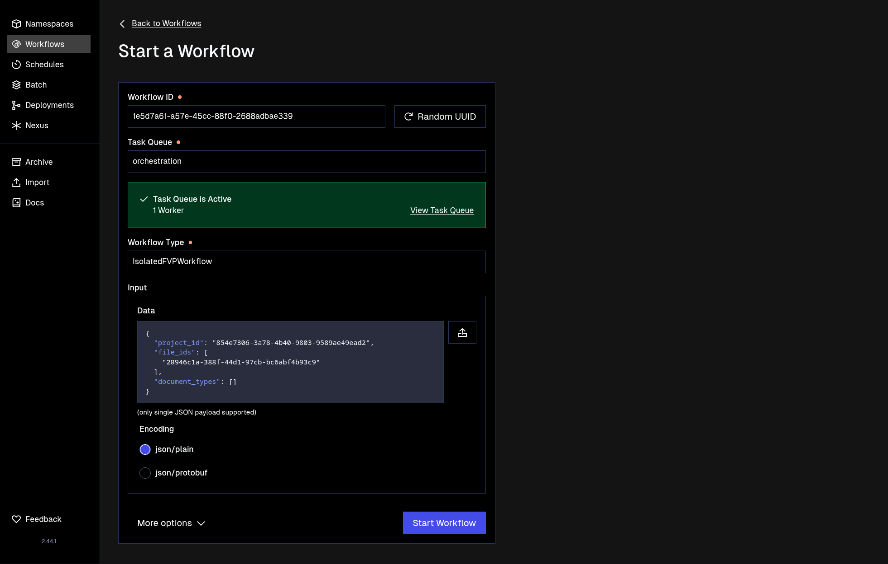

# Quick Start

This guide will walk you through creating your first workflow.

## Prerequisites

- `uv` installed
- `docker` (or any alternative) available
- All services running as outlined in the `README.md` in the repository root

## Steps

1. Start the server

   ```bash
   uv run scripts/quick_start/testrun_ui.py
   ```

2. Open the UI on [`http://localhost:9988/`](http://localhost:9988/)
3. Drop your files into the `uploads` folder (they are gitignored)
4. Then you have two options:
   1. Run a count of files: Set a limit or select all files and click "Run testrun"
   2. Open a dialog with "List Files" and select the specific files you want to use
5. After doing either of these options, you will get two things below. The output of the terminal for debugging purposes and the result of the `upload_testrun.sh` script  
   
6. Copy the payload
7. Open [`http://localhost:8080/namespaces/default/workflows/start-workflow`](http://localhost:8080/namespaces/default/workflows/start-workflow)
8. Generate a random UUID
9. Enter `orchestration` into the input for `Task Queue`
10. Enter `IsolatedFVPWorkflow` into the input for `Workflow Type`
11. Paste the payload you just generated into `Data`
12. Verify everything is correct, it should look like this:
    
13. Click `Start Workflow` and look for a green toast to appear in the bottom right corner. This redirects you directly to the workflow you just created

## Notes

The `LLMMatchingWorkflow` will finish quite quickly. This is because there are no document types specified in `document_types.json`. The information that this service expects is outlined in [`05-modulcluster/modul-formale-pruefung/README.md`](../../05-modulcluster/modul-formale-pruefung/README.md)

You can fill in the document types you want in `document_types.json` and the UI will automatically pick these up when you generate a test run.
